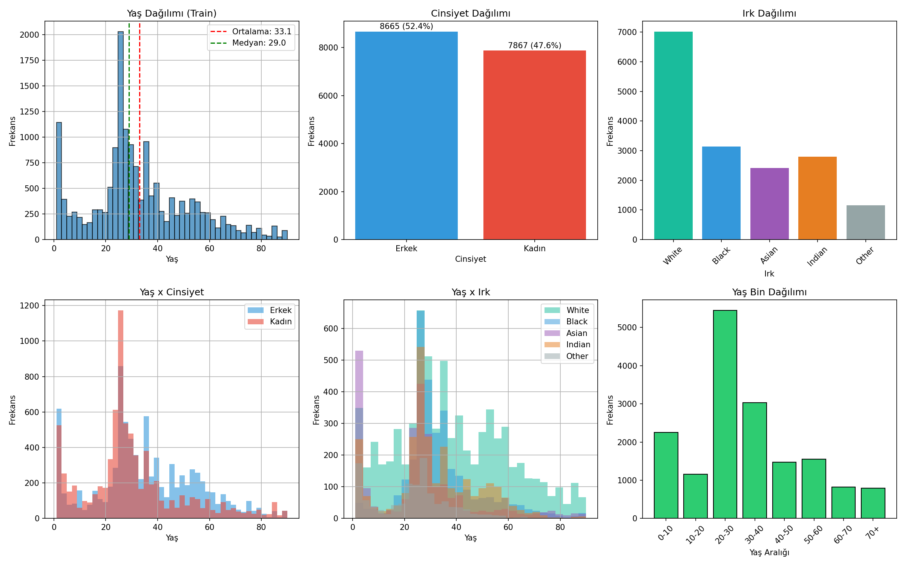
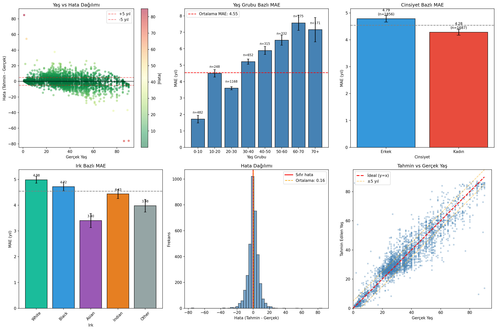

#  Age Estimation with CORAL & Multi-Task Learning (UTKFace)

This repository implements a **nested multi-task deep learning pipeline** for **age estimation from face images**, built on the **UTKFace dataset**.

The model jointly learns:
- **Gender classification**
- **Race classification**
- **Age estimation** using **ordinal regression (CORAL)** and **direct regression**

The project emphasizes **error analysis, bias/fairness evaluation, and data-driven model design**, rather than only reporting a single accuracy metric.

---

##  Key Features

-  **Nested Multi-Task Learning**  
  Gender → Race → Age (each task is conditioned on the previous one)

-  **Ordinal Age Modeling (CORAL)**  
  - 44 thresholds with 2-year intervals  
  - Expected value decoding for continuous age prediction

-  **Ensemble Prediction Strategy**  
  - 60% CORAL (ordinal, stable)  
  - 40% Direct regression (fine-grained)

-  **Bias-Aware Training**  
  - Dataset imbalance analysis  
  - Optimized loss weighting per task  
  - Performance breakdown by age group, gender, and race

-  **Comprehensive Error Analysis**  
  - Worst-case predictions  
  - Age-group MAE  
  - Gender and race bias  
  - Error distribution and outlier inspection

---

## Dataset

**UTKFace Dataset**
- ~20K face images
- Labels: age (1–90), gender, race
- Strong imbalance across age groups and races

### Dataset Distribution (Train Split)


---

## Model Architecture

**Backbone**
- ConvNeXt (via `timm`)

**Prediction Heads**
- Gender classification (CrossEntropy + label smoothing)
- Race classification (conditioned on gender)
- Age estimation:
  - CORAL ordinal head (primary)
  - Direct regression head (auxiliary)

**Loss Composition**
- Gender Loss: `0.4`
- Race Loss: `0.3`
- CORAL Loss: `1.5`
- Regression Loss: `1.2`
- Consistency Loss: `0.2`

---

## Performance Summary

- **Metric**: Mean Absolute Error (MAE)
- **Best Validation MAE**: ~4–5 years
- Strongest performance: **20–40 age range**
- Weaker performance: **60+**, aligned with data scarcity

---

## Error Analysis

A detailed error analysis was conducted on the test set to understand model behavior beyond average metrics.



This includes:
- Age vs. prediction error
- Age-group-wise MAE
- Gender-based MAE
- Race-based MAE
- Prediction vs. ground truth scatter

---

## Worst Predictions

Instead of hiding failures, the model’s largest errors are explicitly analyzed.


Common failure modes:
- Extreme ages (very young / very old)
- Occlusion, blur, or low-resolution images
- Non-frontal or atypical facial poses

---

## Bias & Fairness Insights

- **Gender gap**: ~0.5 MAE difference
- **Race gap** observed and partially mitigated using loss weighting
- Clear correlation between **data scarcity and prediction error**

These findings informed:
- Loss weighting strategy
- CORAL threshold design
- Ensemble weighting choice

---

## Tech Stack

- Python
- PyTorch
- timm
- scikit-learn
- numpy / pandas
- matplotlib
- Jupyter Notebook

---

## How to Run

```bash
pip install -r requirements.txt
